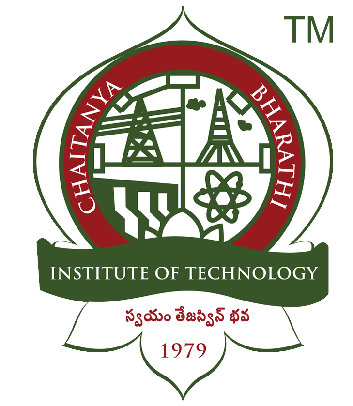

<!-- Home Intro
================================================== -->
 

  

    

      <!--h1 class="font-weight-bold mb-4 serif-font" style="color:#fff">E3Vision 2026</h1-->
      <h2 class="mb-4" style="color:#ff7f27">1st International Conference on E3Vision (E3Vision 2026)</h2>
	  <h3 class="mb-4" style="color:#ff7f27">13 - 14 March 2026</h3>
	  <h4 class="mb-4" style="color:#ff7f27">Organized by Department of EEE, Chaitanya Bharathi Institute of Technology</h4>
      <a href="{{site.baseurl}}/submission" class="btn btn-dark text-white px-5 btn-lg">Submit (Microsoft CMT)</a>
    

    

            
    

  



&nbsp;
## E3Vision 2026

The 1st E3Vision 2026 will bring together a diverse group of experts, researchers, and industry professionals, passionate about advancing sustainability. The conference will explore into the latest developments in sustainable technologies in the fields such as smart grids and microgrids, focusing on enhancing grid resilience, cybersecurity, and power quality. New breakthroughs in battery technologies, energy storage, and charging infrastructure will be explored, along with the seamless integration of renewable energy and electric vehicles.   

Showcasing innovations in smart electronics, including energy-efficient designs and wearable technology for health and environmental monitoring, will be a key highlight. Discussions will cover green manufacturing practices and the role of AI in creating more sustainable electronics. The conference will also feature cutting-edge materials for renewable energy and green construction, as well as innovative use of nanomaterials for environmental cleanup and healthcare applications. 

&nbsp;

---
&nbsp;

## Conference Proceedings

	

		

			

			
All accepted and registered (presented) papers are planned to publish in the proceedings of E3S Web of Conferences.

		

		

			
		

	

&nbsp;

---
## About Chaitanya Bharathi Institute of Technology

	

		

			
		

		

			

			
CHAITANYA BHARATHI INSTITUTE OF TECHNOLOGY, established in the Year 1979, esteemed as the Premier Engineering Institute in the States of Telangana and Andhra Pradesh, was promoted by a Group of Visionaries from varied Professions of Engineering, Medical, Legal and Management, with an Objective to facilitate the Best Engineering and Management Education to the Students and contribute towards meeting the need of Skilled and Technically conversant Engineers and Management Professionals, for the Country that embarked on an Economic Growth Plan.
			
			The Institute, committed to Education and Innovation, started with three-Degree Courses in Engineering for 200 Students and over the 45 Years, has emerged as a Dream Destination for; Students seeking to excel in Engineering and Management Education, Teaching Community to progress with a rewarding Career and Corporates to source well-rounded Engineers.
			
			Stringent Academic Standards, Industry compliant Teaching Methodology, Research Projects from Private and Public Sector Industries in Engineering and Management and Consultancy Practice, enabled the Institute to establish its Identity in the Technical Education and is Ranked No. 1 amongst the Private Engineering Colleges in both the Telugu Speaking States.
			
			The Practices and the Culture at the Institute has always been to provide Quality Education by enhancing the overall Educational experience of Students adopting a wide range of Academic, Practical, Co-Curricular, Extra-Curricular Programs in the State-of-the-Art Facilities, Services and Activities to enable the required exposure to a variety of Social, Cultural, Intellectual, Recreational Opportunities and Challenges. Such learning experiences have enriched the lives of Students and helped them to develop into a Multi-Skilled and Multi -Tasking Personalities that ensured success in their Careers and Occupations. Co-curricular and Extra-Curricular activities are planned and executed through a number of Associations, Clubs, Societies, Students’ Chapters of Professional Bodies, with a view to allow the Students, the necessary freedom to plan and execute every effort and in the process nurture them to be the future Leaders who learn to address Challenges and carve a path of Success.
			
			In its Four Decades of existence, all the Stake Holders of the Institute, relentlessly endeavored to position CBIT as an Institution that is a Leader and an Innovator in the Ecosystem of Engineering Higher Education. With the Students being the singular Objective, the Institute has established excellent Infrastructure such as State-of – the Art Laboratories, spacious Library with Printed and Digital Collection of Books and Journals, Sports, Hostel, and other Infrastructure for Extra and Co-Curricular Engagements with a total Built-up Area of about 57,714 Sq. Mts., in the serene Ambience of 50 Acres to inspire, encourage and pursue Academics. In its relentless strive for Academic excellence, CBIT has scaled great heights both Nationally and Internationally in Industry and Global Universities.
			<b>Visit <a href="https://www.cbit.ac.in">www.cbit.ac.in</a></b>

		

	

