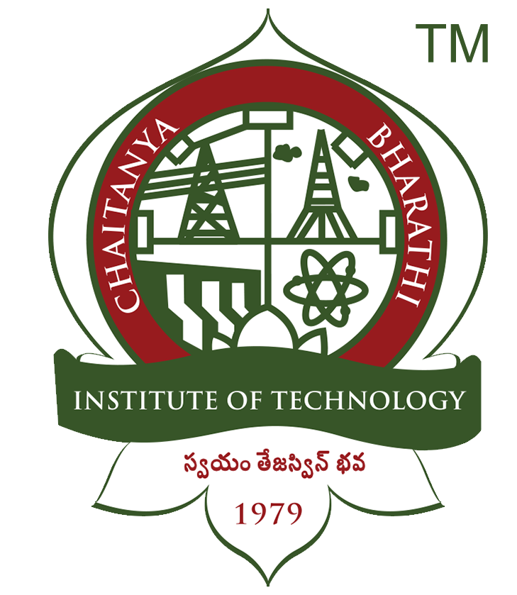

<!-- Home Intro
================================================== -->
 

  

    

      <!--h1 class="font-weight-bold mb-4 serif-font" style="color:#fff">E3Vision 2026</h1-->
      <h2 class="mb-4" style="color:#ff7f27">1st International Conference on Electricity, e-Mobility & Energy Innovation (E3 Vision 2026)</h2>
	  <h3 class="mb-4" style="color:#ff7f27">07 – 08 August 2026</h3>
	  <h4 class="mb-4" style="color:#ff7f27">Organized by Department of EEE, Chaitanya Bharathi Institute of Technology</h4>
      <a href="{{site.baseurl}}/submission" class="btn btn-dark text-white px-5 btn-lg">Submit (Microsoft CMT)</a>
    

    

            
    

  



&nbsp;
## E3Vision 2026

The 1st International Conference on Electricity, e-Mobility & Energy Innovation is a global platform that brings together researchers, industry professionals, policymakers, and academics to explore and advance the latest developments in modern energy systems. The conference addresses the rapidly evolving domains of power generation, transmission and distribution, renewable energy technologies, energy storage, electric mobility, and smart grid digitalization, providing a comprehensive perspective on current trends and future directions in the energy sector. As the world moves toward sustainable and net-zero energy futures, E3 VISION 2026 provides a critical forum to foster interdisciplinary collaboration, encourage the exchange of innovative ideas, and disseminate cutting-edge research. The conference emphasizes the integration of renewable energy sources, advanced energy storage systems, digital grid platforms, and autonomous electric mobility solutions, enabling stakeholders to collectively tackle technical, regulatory, and societal challenges. Through its inclusive and forward-looking program, E3 VISION 2026 highlights the importance of innovation, sustainability, and resilience in modern energy systems. Participants gain insight into transformative technologies and strategies that are shaping the next generation of electricity networks and mobility solutions, bridging the gap between research, industry applications, and policy development. 

&nbsp;

---
&nbsp;

## Conference Proceedings

	

		

			

			
All accepted and registered (presented) papers are planned to publish in the proceedings of E3S Web of Conferences.

		

		

			
		

	

&nbsp;

---
## About Chaitanya Bharathi Institute of Technology

	

		

			
		

		

			

			
Chaitanya Bharathi Institute of Technology (CBIT), established in 1979, is recognized as one of the premier engineering and management institutions in Telangana and Andhra Pradesh. Promoted by a group of visionary professionals from engineering, medical, legal, and management backgrounds, the institute was founded with the objective of delivering quality education and developing skilled, technically competent professionals to contribute to the nation’s economic growth.
			
			CBIT began its academic journey with three undergraduate engineering programs and an intake of 200 students. Over the past 46 years, it has evolved into a preferred destination for students aspiring for excellence, faculty seeking rewarding academic careers, and industries looking for well-trained graduates. The institute is known for its stringent academic standards, industry-aligned teaching methodologies, strong research culture, and active consultancy with public and private sector organizations. Several programs are accredited by the **National Board of Accreditation (NBA)**, and the institute is accredited with **NAAC A++ grade**, reflecting its commitment to academic excellence. CBIT is also consistently ranked in the **NIRF (National Institutional Ranking Framework)**, reinforcing its national standing.
			
			The institute emphasizes holistic student development through a balanced blend of academics, practical learning, co-curricular, and extracurricular activities. With state-of-the-art laboratories, a well-equipped library, modern infrastructure, sports and hostel facilities, and a green 50-acre campus, CBIT provides a vibrant environment that nurtures innovation, leadership, and professional excellence.

			<b>Visit <a href="https://www.cbit.ac.in">www.cbit.ac.in</a></b>

		

	

