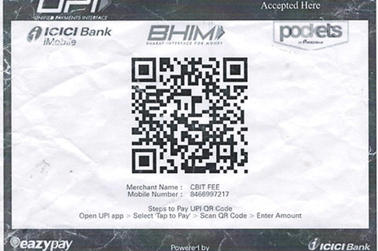

Payment of registration fees must accompany all submitted registration forms. **Registration will not be confirmed until the full payment is received**.  

Authors are requested to pay the **registration fees exclusively through UPI**, including platforms such as **Google Pay**, **PhonePe**, or other UPI-enabled applications.  

Proof of successful payment must be retained by the authors and may be required for verification during the registration confirmation process. 

<table border="2" align="center" style="margin: 0px auto; width:75%">
  <tr>
    <th> Type of Author </th>
    <th> Indian Authors </th>
	<th> Foreign Authors </th>
  </tr>
  <tr>
    <td> Faculty/Students </td>
    <td> Rs. 9000 </td>
	<td>  150 USD </td>
  </tr>
  <tr>
    <td> Industry </td>
    <td> Rs. 9000 </td>
	<td> 150 USD </td>
  </tr>
</table>

<table border="2" align="center" style="margin: 0px auto; width:75%">
  <tr>
    <th></th>
  </tr>
</table>

The registration fee can be paid through **NEFT or UPI**.  

**Bank Details:** 
Bank Name: ICICI Bank 
Account Name: CBIT Fee Collection and Other Receipts 
Account Number: 180401001195 
IFSC Code: ICIC0004385 
SWIFT Code: ICICINBBXXX 
MICR Code: 500229104  

Authors are advised to ensure that the payment details are entered correctly while making the transaction. Proof of payment must be retained for registration confirmation and future reference. 

<!--## Account Details

# Registration Completed

<!-- | Account Name | : | Vardhaman College of Engineering |
| ------------ | ---- | ----------------------------- |
| Bank Name | : | Central Bank of India |
| Branch | : | Gudimalkapuram |
| Account Number | : | 3559461487 |
| IFSC Code | : | CBIN0283080 |
| MICR Code | : | 500016022 |
-->
